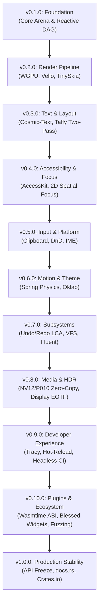

# Martensite Milestone Specification Suite

This directory contains the formal, granular engineering specifications for each development milestone leading to Martensite v1.0.0. Each document defines explicit architectural deliverables, data structures, entry and exit criteria, verified invariants, performance gates, and failure recovery protocols.

---

## Milestone Execution Sequence

---

## Master Milestone Matrix

| Milestone | Specification Document | Primary Target Crates | Core Architectural Focus | Exit Verification Gate |
| :--- | :--- | :--- | :--- | :--- |
| **v0.1.0** | [v0.1.0-foundation.md](v0.1.0-foundation.md) | `martensite-core`, `martensite-reactive` | Generational arena, 64-byte HotNode, push-pull reactive scheduler | 10k DAG propagation <1.0ms; zero generational collisions |
| **v0.2.0** | [v0.2.0-render-pipeline.md](v0.2.0-render-pipeline.md) | `martensite-wgpu`, `martensite-render`, `martensite-window` | WGPU surface lifecycle, Vello Scene translation, TinySkia CPU fallback | Device loss restored <16.6ms; >=99.9% DSSIM fallback parity |
| **v0.3.0** | [v0.3.0-text-layout.md](v0.3.0-text-layout.md) | `martensite-text`, `martensite-layout` | Two-tier text cache, Taffy two-pass layout bridge, zero 1-frame lag | 1,000 flex nodes laid out in <0.5ms; text hit rate >98% |
| **v0.4.0** | [v0.4.0-accessibility-focus.md](v0.4.0-accessibility-focus.md) | `martensite-access`, `martensite-focus` | AccessKit semantic tree sync, 2D projected-beam focus navigation | 100% WCAG 2.1 AA tree compliance; deterministic 2D tab order |
| **v0.5.0** | [v0.5.0-input-platform.md](v0.5.0-input-platform.md) | `martensite-clipboard`, `martensite-dnd`, `martensite-window` | Detached DnD session, multi-MIME clipboard, velocity-damped IME | Multi-window drag survival; IME position alignment during kinetic scroll |
| **v0.6.0** | [v0.6.0-motion-theme.md](v0.6.0-motion-theme.md) | `martensite-motion`, `martensite-theme` | Closed-form analytical spring solver, Oklab perceptual color blending | Analytical accuracy within 1e-6; zero allocation in animation loop |
| **v0.7.0** | [v0.7.0-subsystems.md](v0.7.0-subsystems.md) | `martensite-history`, `martensite-assets`, `martensite-l10n` | LCA tree undo/redo ledger, dual-mode VFS, Project Fluent l10n | 10k transaction rollback integrity; <10µs memory VFS resolution |
| **v0.8.0** | [v0.8.0-media-hdr.md](v0.8.0-media-hdr.md) | `martensite-media`, `martensite-wgpu` | Zero-copy NV12/P010 surfaces, BT.2020 PQ EOTF, adaptive SDR luminance | 4K 60fps at ~0.0ms CPU dispatch; Delta E < 1.0 color accuracy |
| **v0.9.0** | [v0.9.0-developer-experience.md](v0.9.0-developer-experience.md) | `martensite-devtools`, `cargo-martensite`, `martensite-macros`, `martensite-test` | In-app Tracy HUD, cdylib hot-reload CLI, VirtualClock headless test harness | Hot reload code swap <350ms; deterministic headless golden frames |
| **v0.10.0** | [v0.10.0-plugins-ecosystem.md](v0.10.0-plugins-ecosystem.md) | `martensite-plugin`, `martensite-blessed` | Wasmtime ring-buffer ABI, blessed widget suite, 48h soak fuzzing | Plugin execution <2.0ms/frame; 48h continuous fuzz with 0 panics |
| **v1.0.0** | [v1.0.0-production-release.md](v1.0.0-production-release.md) | Complete Workspace (22 crates) | Public API freeze, 100% docs.rs coverage, security audit sign-off | Zero compiler warnings; cargo audit clean; Crates.io release |

---

## Milestone Verification Governance

Every milestone implementation must fulfill three verification stages before merging:
1. **Compilation & Static Checks:** `cargo check --workspace` and `cargo clippy --workspace -- -D warnings` must exit cleanly with zero warnings.
2. **Automated Test Suite:** `cargo test --workspace` must achieve 100% pass rate with zero flaky tests.
3. **Milestone Exit Gate Audit:** The criteria explicitly defined in the corresponding milestone specification must be validated on CI reference runners across Windows, macOS, and Linux.
