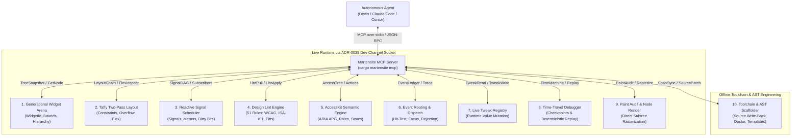

# Research: Comprehensive AI-Assisted UI Development via Model Context Protocol (MCP)

**Author:** Martensite Architecture Working Group  
**Status:** Completed & Ratified  
**Target:** Martensite v0.20.0 Developer Experience Initiative (Workstream W10)  
**Cross-References:** [ADR-0036](../adr/ADR-0036-in-app-inspector.md) (In-App Inspector), [ADR-0037](../adr/ADR-0037-hot-reload-contract.md) (Hot-Reload Contract), [ADR-0038](../adr/ADR-0038-dev-channel.md) (Dev Channel), [ADR-0039](../adr/ADR-0039-mcp-server-for-ai-assisted-development.md) (Martensite MCP Server), [`docs/dx/MCP.md`](../dx/MCP.md)

---

## 1. Executive Summary & Problem Space

Modern software engineering is undergoing a shift in development workflows: they are increasingly orchestrated by autonomous AI coding agents (such as Devin, Claude Code, Cursor, and Windsurf). While large language models (LLMs) have achieved high competency in generating algorithmic Rust and CLI tools, **graphical user interface (GUI) development remains error-prone, hallucination-heavy, and friction-laden**.

The primary failure mode of AI-assisted GUI engineering is **lack of grounded runtime observability**:
1. **Blind Generation:** Agents write widget code based on static API recall, unable to observe actual constraint propagation, Taffy flex calculations, clipping bounds, or hierarchical layout results.
2. **Brittle Visual Feedback:** Existing visual agent workflows rely on OS-level screenshot capture and computer-vision OCR (e.g., via `ultranix-mcp` or `ultramac`). While adequate for high-level visual sanity checks and black-box OS interaction, image pixels cannot explain *why* a widget overflowed by 14.5px, which flex container clamped its bounds, why an event handler was ignored, or which reactive signal failed to notify its subscribers.
3. **Slow Feedback Loops:** The standard cycle of `Edit code → Cargo build → Launch app → Capture screenshot → Analyze image → Guess fix` takes 30–90 seconds per iteration and consumes tens of thousands of vision tokens without semantic certainty.

To make Martensite the premier GUI framework for human and autonomous AI collaboration, Martensite must provide a **first-party, native Model Context Protocol (MCP) server** (`martensite-mcp` / `cargo martensite mcp`). This server exposes the rich, semantic internals of the running application—its generational widget arena, Taffy layout boxes, reactive signal DAG, design lint engine, AccessKit semantic tree, event ledger, and live tweak registry—directly into standard agent toolchains over JSON-RPC stdio.

---

## 2. Comparative Analysis: Existing Agentic UI Paradigms

| Paradigm | Exemplars | Agent Feedback Channel | Strengths | Fatal Flaws for UI Engineering |
| :--- | :--- | :--- | :--- | :--- |
| **Black-Box OS Vision** | `ultranix-mcp`, `ultramac`, OS-level vision models | Screenshots (PNG/JPEG), OCR bounding boxes, AT-SPI2 / OS a11y tree | Platform-agnostic; exercises real display server and compositor | Zero layout semantics; cannot inspect flex constraints, reactive state, or design tokens; high token cost; pixel drift |
| **Web Browser CDP** | Chrome DevTools Protocol, Playwright MCP | Full DOM tree, CSS computed styles, box model, JS console, network logs | Complete structural, layout, and style ground truth | Confined to Chromium/Web; massive memory and process overhead; does not map to native Rust compilation or lifetimes |
| **Mobile Toolchains** | Flutter DevTools / Dart Tooling Daemon (DTD) | VM service JSON-RPC, widget inspector service, layout explorer | Rich widget tree and constraint diagnostics | Plagued by out-of-process version skew (documented in Flutter #8822, #100247); slow startup; separate Dart VM dependency |
| **Terminal / CLI Only** | Traditional `cargo check`, `cargo test` | Compiler diagnostics, stderr, panic backtraces | Fast, zero runtime overhead | Completely blind to visual presentation, responsive layout, color contrast, and interactive behavior |
| **Martensite First-Party MCP** | `martensite-mcp` (`cargo martensite mcp`) | **Native Semantic Ground Truth:** Generational Widget Arena, Taffy layout passes, reactive signal DAG, 51-rule design lint, AccessKit tree, live tweak mutations, source span tracking | Sub-millisecond queries; zero-skew via ADR-0038 dev channel; bidirectional source synchronization; compiled out in release | Requires local dev-channel Unix socket or offline scene dump |

---

## 3. The Ten Semantic Pillars of Comprehensive Agent Access

To let autonomous agents author, refine, debug, and verify Martensite user interfaces, the MCP server must provide comprehensive access across ten distinct semantic pillars:

### Pillar 1: Generational Widget Arena (`martensite-core`)
- **Requirement:** Agents must be able to explore the widget tree with arbitrary depth or pagination without incurring eager allocation penalties.
- **Capabilities:**
  - Query root-to-leaf paths, parent-child relations, and internal widget protocols (`child_count`/`child`/`child_bounds`).
  - Search nodes by `debug_name`, `WidgetId`, structural role, or semantic marker (e.g., `@alarm`, `@kpi`, `@level:1`).
  - Access logical bounds, physical device pixel bounds, clipping rects, and visibility flags.

### Pillar 2: Two-Pass Taffy Layout Diagnostics (`martensite-layout`)
- **Requirement:** When UI breaks or overflows, agents must understand the mathematical root cause rather than guessing padding adjustments.
- **Capabilities:**
  - Full trace of Taffy constraint propagation: input constraints (`MinContent`, `MaxContent`, `Definite`), flex basis, flex-grow/shrink ratios, padding, margin, and gap.
  - Granular overflow explanation: identifies exact overflow axes, pixel magnitudes, and the ancestral container responsible for clipping or non-scrolling constraints.

### Pillar 3: Reactive Signal DAG Inspection (`martensite-reactive`)
- **Requirement:** UI state bugs in reactive architectures stem from broken dependency chains, missing signal reads, or redundant evaluations.
- **Capabilities:**
  - Graph introspection: list all active `SignalId`s, their current serialized values, and their subscriber sets.
  - Read-write signal probing: trigger a synthetic signal change and observe the exact downstream dirty bitset and invalidation cascade.

### Pillar 4: Design Lint & Standards Enforcement (`martensite-design-lint`)
- **Requirement:** Martensite features an unmatched 51-rule design linter enforcing WCAG 2.2, ISA-101, ISA-18.2, Hick-Hyman, Gestalt laws, and Tufte data-ink metrics. Agents must receive structured, cited feedback.
- **Capabilities:**
  - Pull live lint findings categorized by severity (`Forbid`, `Warn`, `Info`), citation URL (`docs/design-standards/rules/<id>.md`), and offending node path.
  - Apply `LintFix` transformations directly to the scene model or generate safe Rust code diffs.

### Pillar 5: Accessibility & Semantic Contract (`martensite-access`)
- **Requirement:** Autonomous code generation must never produce inaccessible interfaces.
- **Capabilities:**
  - Full inspection of the AccessKit tree mirror, including ARIA roles, accessible names, descriptions, states (disabled, expanded, checked), and supported actions (`Click`, `SetValue`, `ScrollIntoView`).

### Pillar 6: Event Dispatch & Hit-Test Observability (`martensite-window`, `martensite-focus`)
- **Requirement:** When a synthetic or real click produces no result, agents must know why the event was dropped.
- **Capabilities:**
  - Query the `EventRecord` ledger: hit-test resolution, event bubbling path, modal focus traps, and rejection reasons (`HitTestMiss`, `PointerCapture`, `DisabledState`, `BoundsClip`).

### Pillar 7: Live Tweaking & Source Synchronization (`martensite-devtools::tweak`)
- **Requirement:** AI fine-tuning of visual aesthetics (spacing, paddings, typography sizes, spring stiffness) requires sub-millisecond visual confirmation followed by permanent code persistence.
- **Capabilities:**
  - Mutate registered live tweak parameters in real-time.
  - Synchronize converged tweak values back to the original `.rs` source files using `#[track_caller]` and compiler source spans.

### Pillar 8: Deterministic Time-Travel Debugging (`martensite-devtools::timemachine`)
- **Requirement:** Reproducing intermittent UI glitches requires stepping backward and forward in execution history.
- **Capabilities:**
  - Inspect journaled interaction events, restore historical arena/signal checkpoints, and step through frame states under a deterministic `VirtualClock`.

### Pillar 9: In-Engine Subtree Rasterization & Paint Audit (`martensite-render`, `martensite-access`)
- **Requirement:** Multimodal agents need to visually inspect individual components without capturing unrelated desktop clutter.
- **Capabilities:**
  - Headless, off-screen rasterization of any specific `WidgetId` directly to PNG/JPEG base64.
  - Automated paint audits verifying text ink clearance (preventing descender clipping) and WCAG contrast against dynamic backgrounds.

### Pillar 10: Toolchain Diagnostics & Scaffolding (`tools/cargo-martensite`)
- **Requirement:** Autonomous agent operations span the entire development lifecycle, from initial scaffolding to pre-commit health checks.
- **Capabilities:**
  - Run environment diagnostics (`doctor` check: Vulkan, wgpu, linkers, toolchains).
  - Scaffold new widgets, pages, or full projects with pre-configured agent guidelines (`AGENTS.md`, `llms.txt`, `design-lint.toml`).

---

## 4. Architectural Boundaries, Security & Governance

### Constraint D1 Compliance (Version Locking)
To avoid Flutter's devastating DevTools skew failure modes (Flutter #8822, #100247), the Martensite MCP server and the running application share the exact protocol handshake specified in ADR-0038:
- The MCP server connects to the dev-channel Unix socket (`$XDG_RUNTIME_DIR/martensite/<build_id>.sock`).
- During connection, a mandatory `hello` handshake verifies `protocol: 1` and matches `MARTENSITE_VERSION`.
- Any version mismatch fails loudly and immediately, preventing subtle state corruption.

### Constraint D8 Compliance (Zero-Cost Release Boundary)
- All dev-channel listener sockets, tweak registries, and inspector hooks are feature-gated behind `devtools`.
- In release builds (`--release` or without `devtools`), the dev channel does not compile, exposing zero network/socket surfaces and zero binary bloat.

### Constraint D9 Compliance (Semantic Honesty & Comprehensive Agent Parity)
- AI agents must interact with the exact same semantic truth as human engineers—no hallucinated UI structures, no brittle pixel scraping when semantic geometry exists, and no mutation without an explicit audit trail.
- The MCP server exposes granular, node-level diagnostics, full reactive DAG inspection, and live-to-source parameter synchronization under strict workspace path confinement (`src/`) and explicit confirmation gates (`confirmed: true`).
- In-memory preview mutations (e.g. `martensite_apply_lint_fix` with `target: scene`) mutate solely the ephemeral `LintScene` model for mathematical convergence verification, strictly preserving the authoritative live `WidgetArena` per ADR-0038.

### Offline Operation Mode

When no live application is running, the MCP server does not abort. Instead, it enters **Offline Project Mode**, offering:
- Static design linting over saved `.scene` snapshots.
- Source-level widget scaffolding and template generation.
- Toolchain and workspace health diagnostics (`cargo martensite doctor`).
- Headless test execution and golden-frame validation via `martensite-test`.

---

## 5. Strategic Value & Impact

Integrating a dedicated, comprehensive MCP server directly into Martensite transforms the framework into **the most agent-friendly GUI toolkit in existence**:
1. **10x Faster AI Feedback Loop:** Eliminates the slow compile-and-screenshot loop. An agent can inspect layout constraints, tweak paddings, and verify design lint compliance in milliseconds.
2. **Defensible Design Standards:** Autonomous agents are guaranteed to produce WCAG 2.2 AAA compliant, ISA-101 industrial-grade UIs by virtue of continuous MCP linting.
3. **IDE & Agent Integration:** Standard MCP stdio transport provides compatibility with Antigravity, Devin, Claude Code, Cursor, and any MCP-compliant harness.
