# Martensite Dependency Graph (v0.x -> v1.0.0)

**Document Identifier:** DOC-0001-DEP-GRAPH
**Status:** Canonical

## Crate Dependency DAG

```mermaid
graph TD
    %% Meta-crate
    martensite --> martensite-window
    martensite --> martensite-reactive
    martensite --> martensite-core
    martensite --> martensite-macros
    
    %% Windowing & Input
    martensite-window --> martensite-core
    martensite-window --> martensite-render
    martensite-window --> martensite-access
    martensite-window --> martensite-focus
    martensite-window --> martensite-clipboard
    martensite-window --> martensite-dnd

    %% Rendering
    martensite-render --> martensite-wgpu
    martensite-render --> martensite-text
    martensite-render --> martensite-theme
    martensite-render --> martensite-assets
    martensite-render --> martensite-media
    martensite-render --> martensite-core

    %% State & Architecture
    martensite-core --> martensite-layout
    martensite-core --> martensite-reactive
    martensite-core --> martensite-history
    
    %% Utilities
    martensite-motion --> martensite-core
    martensite-l10n --> martensite-core
    
    %% Testing & Dev
    martensite-devtools --> martensite-core
    martensite-devtools --> martensite-history
    martensite-devtools --> martensite-reactive
    martensite-test --> martensite-core
    martensite-test --> martensite-render

    %% Shell & Platform (v0.13.0)
    martensite-shell --> martensite-window
    martensite-shell --> martensite-theme
    martensite-accesskit-winit --> martensite-access
    martensite-clipboard-platform --> martensite-clipboard
    martensite-font-fallback --> martensite-text
    martensite-cosmic-text --> martensite-text

    %% Plugins & Blessed (v0.9.0/v0.10.0)
    martensite-plugin --> martensite-core
    martensite-plugin --> martensite-render
    martensite-host --> martensite-core
    martensite-blessed --> martensite
    martensite-blessed --> martensite-motion

    %% Media platform (v0.8.0 / v0.16.0)
    martensite-media --> martensite-wgpu
    martensite-media-platform --> martensite-media
    martensite-media-test --> martensite-media
    martensite-text-reference --> martensite-text
    martensite-render-test --> martensite-render

    %% Engine bridge (v0.14.0 / v0.15.0)
    martensite-engine-bridge --> martensite-core
    martensite-wgpu --> martensite-engine-bridge
    martensite-bevy --> martensite-engine-bridge
    martensite-godot --> martensite-engine-bridge
    martensite-access-platform --> martensite-access
```

## Architectural Layers

1. **Foundational (Tier 0):** `martensite-wgpu`, `martensite-reactive`, `martensite-macros`
2. **Structural (Tier 1):** `martensite-core`, `martensite-layout`, `martensite-theme`
3. **Features (Tier 2):** `martensite-text`, `martensite-motion`, `martensite-history`, `martensite-access`
4. **Integration (Tier 3):** `martensite-render`, `martensite-window`, `martensite-shell`, `martensite-engine-bridge` (v0.14.0)
5. **Facade (Tier 4):** `martensite`
6. **Platform/FFI boundary (allowed-unsafe):** `martensite-font-fallback`, `martensite-clipboard-platform`, `martensite-media-platform`, `martensite-shell`, `martensite-host`, `martensite-accesskit-winit` (vendored), `martensite-cosmic-text` (vendored), `martensite-godot` (v0.15.0), `martensite-access-platform` (v0.17.0)
7. **Optional adapters:** `martensite-bevy` (v0.15.0), `martensite-godot` (v0.15.0) — never in the default build; pin their own engine versions.
