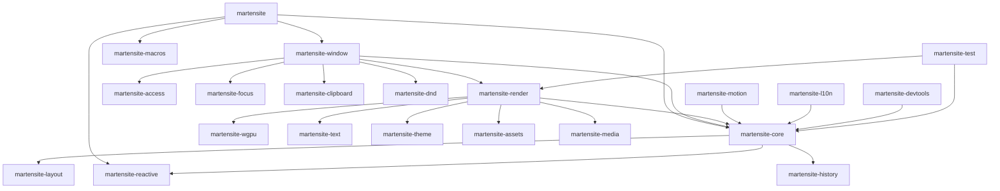

# Martensite Dependency Graph (v0.x -> v1.0.0)

**Document Identifier:** DOC-0001-DEP-GRAPH
**Status:** Canonical

## Crate Dependency DAG

## Architectural Layers

1. **Foundational (Tier 0):** `martensite-wgpu`, `martensite-reactive`, `martensite-macros`
2. **Structural (Tier 1):** `martensite-core`, `martensite-layout`, `martensite-theme`
3. **Features (Tier 2):** `martensite-text`, `martensite-motion`, `martensite-history`, `martensite-access`
4. **Integration (Tier 3):** `martensite-render`, `martensite-window`
5. **Facade (Tier 4):** `martensite`
