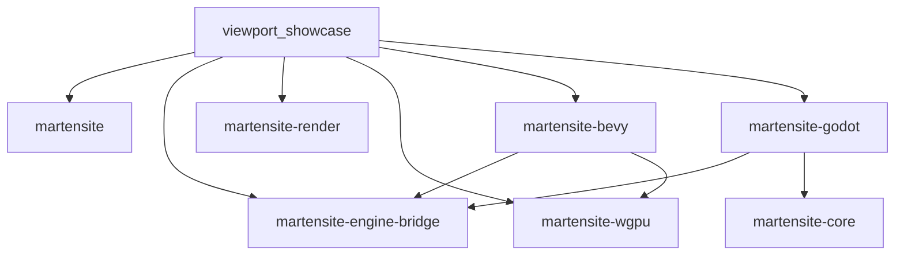

# Martensite Dependency Graph (v0.15.0)

**Document Identifier:** DOC-0001-DEP-GRAPH
**Status:** Canonical — regenerated from `Cargo.toml` manifests (2026 workspace state)

Edges read `A --> B` = "A depends on B". Solid edges are unconditional
`[dependencies]`; dotted edges (`-.->`) are optional/feature-gated or
`[dev-dependencies]`-only edges. External crates (`wgpu`, `winit`,
`accesskit`, `taffy`, `vello`, …) are omitted.

## Published Workspace Members (31 crates)

```mermaid
graph TD
    %% ── Facade ──────────────────────────────────────────────
    martensite --> martensite-core
    martensite --> martensite-reactive
    martensite --> martensite-layout
    martensite --> martensite-wgpu
    martensite --> martensite-render
    martensite --> martensite-text
    martensite --> martensite-access
    martensite --> martensite-window
    martensite --> martensite-focus
    martensite --> martensite-clipboard
    martensite --> martensite-dnd
    martensite --> martensite-theme
    martensite --> martensite-motion
    martensite --> martensite-history
    martensite --> martensite-assets
    martensite --> martensite-l10n
    martensite --> martensite-media
    martensite --> martensite-engine-bridge
    martensite --> martensite-macros
    martensite -.->|optional: native-fallback| martensite-font-fallback
    martensite -.->|dev| martensite-test
    martensite -.->|dev| martensite-devtools
    martensite -.->|dev| martensite-plugin

    %% ── Tier 3 ──────────────────────────────────────────────
    martensite-wgpu --> martensite-core
    martensite-wgpu --> martensite-render
    martensite-wgpu --> martensite-media
    martensite-wgpu --> martensite-engine-bridge
    martensite-wgpu --> martensite-media-platform
    martensite-wgpu --> martensite-theme

    martensite-test --> martensite-clipboard
    martensite-test --> martensite-core
    martensite-test --> martensite-dnd
    martensite-test --> martensite-focus
    martensite-test --> martensite-reactive
    martensite-test --> martensite-window

    martensite-plugin --> martensite-core
    martensite-plugin --> martensite-render
    martensite-plugin --> martensite-reactive

    martensite-blessed --> martensite-core
    martensite-blessed --> martensite-render
    martensite-blessed --> martensite-text
    martensite-blessed -.->|dev| martensite-access
    martensite-blessed -.->|dev| martensite-plugin
    martensite-blessed -.->|dev| martensite-test

    martensite-font-fallback --> martensite-text

    %% ── Tier 2 ──────────────────────────────────────────────
    %% (devtools is Tier 2 by unconditional deps; its optional
    %% `render` feature adds an edge to Tier-2 martensite-render)
    martensite-devtools --> martensite-core
    martensite-devtools -.->|optional: render| martensite-render

    martensite-access --> martensite-core
    martensite-access --> martensite-accesskit-winit
    martensite-access -.->|dev| martensite-text

    martensite-assets --> martensite-core
    martensite-assets -.->|optional: reactive| martensite-reactive

    martensite-clipboard --> martensite-core
    martensite-clipboard -.->|optional: platform| martensite-clipboard-platform

    martensite-dnd --> martensite-core
    martensite-engine-bridge --> martensite-core
    martensite-focus --> martensite-core

    martensite-history --> martensite-core
    martensite-history --> martensite-reactive

    martensite-l10n --> martensite-core
    martensite-l10n --> martensite-reactive

    martensite-layout --> martensite-core

    martensite-media --> martensite-core
    martensite-media --> martensite-media-platform

    martensite-render --> martensite-core

    martensite-text --> martensite-core
    martensite-text --> martensite-cosmic-text

    martensite-window --> martensite-core
    martensite-window --> martensite-shell

    %% ── Tier 1 ──────────────────────────────────────────────
    martensite-core --> martensite-reactive
    martensite-shell --> martensite-theme

    %% ── Tier 0 (no workspace deps) ──────────────────────────
    %% martensite-reactive, martensite-macros, martensite-cosmic-text,
    %% martensite-accesskit-winit, martensite-theme, martensite-motion,
    %% martensite-host, martensite-clipboard-platform, martensite-media-platform
```



## Non-Published Workspace Members (`publish = false`, 7 crates)

These are workspace members but are never published to crates.io.

```mermaid
graph TD
    martensite-media-test --> martensite-media
    martensite-media-test --> martensite-media-platform
    martensite-media-test -.->|dev| martensite-wgpu

    martensite-render-test --> martensite-render
    martensite-render-test -.->|dev| martensite-test
    martensite-render-test -.->|dev| martensite-wgpu

    martensite-text-reference --> martensite-test
    martensite-text-reference -.->|dev| martensite-text
    martensite-text-reference -.->|dev| martensite-render
    martensite-text-reference -.->|dev| martensite-cosmic-text

    cargo-martensite --> martensite-host

    engine_embed --> martensite
    engine_embed --> martensite-engine-bridge
    engine_embed --> martensite-render
    engine_embed --> martensite-wgpu

    industrial_dashboard --> martensite

    bench_suite --> martensite
    bench_suite --> martensite-core
    bench_suite --> martensite-reactive
```



| Crate | Path | Workspace deps |
|---|---|---|
| `martensite-media-test` | `crates/martensite-media-test` | media, media-platform (+dev: wgpu) |
| `martensite-render-test` | `crates/martensite-render-test` | render (+dev: test, wgpu) |
| `martensite-text-reference` | `crates/martensite-text-reference` | test (+dev: text, render, cosmic-text) |
| `cargo-martensite` | `tools/cargo-martensite` | host |
| `engine_embed` | `examples/engine_embed` | martensite, engine-bridge, render, wgpu |
| `industrial_dashboard` | `examples/industrial_dashboard` | martensite |
| `bench_suite` | `benches/bench_suite` | martensite, core, reactive |

## Excluded Crates (`workspace.exclude`, `publish = false`)

Not workspace members — each has its own `[workspace]` table and lockfile.
Path deps still resolve into the parent workspace. Checked by the dedicated
`adapters` CI job, never in the default build.



| Crate | Path | Workspace deps | Notes |
|---|---|---|---|
| `martensite-bevy` | `crates/martensite-bevy` | engine-bridge, wgpu | Bevy main git pin (MSRV 1.96) |
| `martensite-godot` | `crates/martensite-godot` | engine-bridge, core | GDExtension cdylib (MSRV 1.94) |
| `viewport_showcase` | `examples/viewport_showcase` | martensite, engine-bridge, render, wgpu, bevy, godot | v0.15.0 verification app |

## Planned Crates

- `martensite-access-platform` **(planned v0.17.0)** — listed in earlier
  revisions of this document but not yet implemented; no `crates/martensite-access-platform`
  directory exists. Expected edge: `martensite-access-platform --> martensite-access`.
- `stubs/martensite` and `stubs/martensite-ui` — `0.0.1` namespace-reservation
  stubs (`publish = false`), not workspace members, no dependencies.

## Architectural Layers

Tier of a crate = `1 + max(tier of its workspace deps)`; unconditional
`[dependencies]` only (optional and dev edges noted separately).

1. **Foundational (Tier 0)** — zero workspace dependencies:
   `martensite-reactive`, `martensite-macros`, `martensite-cosmic-text`,
   `martensite-accesskit-winit` (vendored), `martensite-theme`,
   `martensite-motion`, `martensite-host`, `martensite-clipboard-platform`,
   `martensite-media-platform`
2. **Core (Tier 1)** — depend only on Tier 0:
   `martensite-core` → reactive; `martensite-shell` → theme
3. **Features (Tier 2)** — depend on Tier 0–1:
   `martensite-access`, `martensite-assets`, `martensite-clipboard`,
   `martensite-devtools`, `martensite-dnd`, `martensite-engine-bridge`,
   `martensite-focus`, `martensite-history`, `martensite-l10n`,
   `martensite-layout`, `martensite-media`, `martensite-render`,
   `martensite-text`, `martensite-window`
   (`martensite-devtools` has an *optional* dep on `martensite-render` via
   its `render` feature; counted it is Tier 3.)
4. **Integration (Tier 3)** — depend on Tier ≤ 2:
   `martensite-wgpu`, `martensite-test`, `martensite-plugin`,
   `martensite-blessed`, `martensite-font-fallback`
5. **Facade (Tier 4):** `martensite` — depends on all of the above
   (`martensite-font-fallback` only via the optional `native-fallback`
   feature; `test`/`devtools`/`plugin` as dev-deps).

## Platform/FFI Boundary (`#![allow(unsafe_code)]`)

The only crates permitted unsafe code, per `AGENTS.md` — all are leaf or
near-leaf crates so the boundary stays at the edge of the graph:

- `martensite-font-fallback` (Tier 3) — DirectWrite / CoreText / Fontconfig FFI
- `martensite-clipboard-platform` (Tier 0) — NSPasteboard / Win32 / X11 FFI
- `martensite-media-platform` (Tier 0) — IOSurface / DXGI / dmabuf FFI
- `martensite-host` (Tier 0) — `dlopen` / `LoadLibrary` dynamic loading
- `martensite-cosmic-text` (Tier 0) — vendored upstream fork
- `martensite-accesskit-winit` (Tier 0) — vendored upstream fork
- `martensite-shell` (Tier 1) — DWM / NSVisualEffectView / Wayland CSD
- `martensite-godot` (excluded) — GDExtension FFI

## Corrections vs. Previous Revision

The pre-regeneration version of this document contained ~15 inverted or
phantom edges written for the original 21-crate scaffold. Notable fixes:

- `martensite-wgpu --> martensite-render` (was inverted)
- `martensite-layout --> martensite-core` (was inverted)
- `martensite-text --> martensite-cosmic-text` (was inverted)
- `martensite-media --> martensite-media-platform` (was inverted)
- `martensite-wgpu --> martensite-media` (was inverted)
- `martensite-access --> martensite-accesskit-winit` (was inverted; dep is
  the `accesskit_winit` package alias)
- `martensite-clipboard -.-> martensite-clipboard-platform` (was inverted;
  optional `platform` feature — clipboard-platform intentionally has no
  back-edge to avoid a cycle)
- `martensite-window --> martensite-shell` (was inverted); window's only
  workspace deps are `core` + `shell` — the old `window --> access/focus/
  clipboard/dnd/render` edges were phantom
- `martensite-motion` and `martensite-theme` have zero workspace deps
  (Tier 0); old `motion --> core` was phantom
- `martensite-devtools --> history/reactive` and `martensite-test --> render`
  were phantom; `martensite-render --> wgpu/text/theme/assets/media` were
  all phantom
- Phantom `martensite-access-platform` node removed (now listed under
  Planned Crates)

## Regenerating This Document

```sh
# List every workspace-internal edge (deps + dev-deps + optional):
cargo metadata --format-version 1 --no-deps | python3 -c '
import json, sys
meta = json.load(sys.stdin)
for p in sorted(meta["packages"], key=lambda x: x["name"]):
    ws = sorted({d["name"] for d in p["dependencies"] if d.get("path")})
    print(p["name"] + ": " + ", ".join(ws))
'

# Or inspect manifests directly:
grep -rn 'workspace = true\|path = "' crates/*/Cargo.toml \
    tools/cargo-martensite/Cargo.toml examples/*/Cargo.toml \
    benches/bench_suite/Cargo.toml
```

Notes:

- `cargo metadata` reports dependencies by their *declared* name, so
  `accesskit_winit` (package `martensite-accesskit-winit`) and
  `cosmic-text` (package `martensite-cosmic-text`) appear under their
  alias — map them via `[workspace.dependencies]` in the root manifest.
- Excluded crates (`martensite-bevy`, `martensite-godot`,
  `viewport_showcase`) are not workspace members and do not appear in
  `cargo metadata` output; read their manifests manually.
